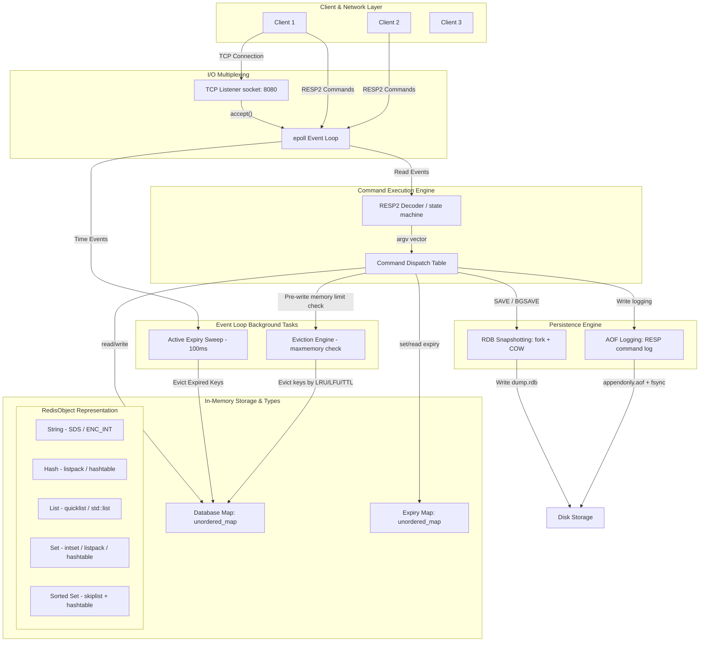

# Redis Lite Design Document

This document outlines the architecture, design choices, trade-offs, and design justifications for Redis Lite, a lightweight, single-threaded, in-memory key-value store built in C++ using an `epoll` reactor event loop.

## Architecture Diagram

The diagram below details the end-to-end request flow, event multiplexing loop, in-memory structures, and persistence layers.

---

## Design Decisions & Technical Trade-offs

### 1. Why a single-threaded event loop instead of a thread pool?
Redis Lite uses a single-threaded event loop (powered by `epoll`) rather than a multi-threaded design or thread pool.
- **Simplification of State**: In-memory data structures (dictionaries, lists, skip lists) do not require lock synchronization (mutexes, spinlocks, read-write locks). This completely eliminates locking overhead, contention, and potential deadlocks.
- **Context-Switching Overhead**: Threaded architectures with high client counts incur significant context-switching cost and cache thrashing as the operating system schedules threads. A single thread servicing file descriptors as they become ready maximizes L1/L2 cache locality.
- **CPU Bottleneck**: The primary bottleneck in an in-memory key-value database is network I/O and memory bandwidth, not CPU compute. An event loop maximizes network throughput.

### 2. Why a Skip List over a Red-Black Tree for Sorted Sets (ZSET)?
Sorted sets in Redis Lite are implemented using a combination of a hash map (for $O(1)$ score lookups) and a Skip List (for range and rank queries).
- **Simpler Implementation and Concurrent Safety**: Skip lists are far easier to implement and balance than self-balancing BSTs like Red-Black trees.
- **Range Queries**: Skip lists are essentially linked lists at Level 1, meaning range traversal (e.g., `ZRANGE`) is a simple linear traversal of the bottom level once the start node is found. Red-Black trees require complex tree successors/predecessors (involving parents and sibling nodes), which is slower and more cache-unfriendly.
- **Memory Adjustments**: Skip lists allow customizable node height distribution. Using a promotion probability of $0.25$ ensures that most nodes stay at height $1$, saving pointer overhead.

### 3. How does fork() + COW make non-blocking snapshotting (BGSAVE) possible?
To save a snapshot without blocking incoming queries, the server invokes `fork()`.
- **Process Duplication**: The `fork()` system call creates a child process with an exact duplicate of the parent's page tables.
- **Copy-On-Write (COW)**: Instead of duplicating physical memory immediately, the OS marks all memory pages as read-only.
- **Isolation of Snapshot**: The child process iterates the data structures at the moment of `fork()` and writes them to the RDB file. If a write command arrives at the parent during this process, the parent modifies the page, triggering a page fault. The OS then duplicates that specific page for the parent, ensuring the child's snapshot memory remains completely frozen and unmodified.

### 4. What is the trade-off between RDB and AOF? Why run both?
- **RDB (Redis Database)**: 
  - *Pros*: Highly compact binary serialization. Fast startup/load times. Zero runtime write overhead (delegated to background child process).
  - *Cons*: High data loss risk (data is only saved as often as the snapshot interval).
- **AOF (Append-Only File)**:
  - *Pros*: Very durable. It appends write commands to a log file. With `appendfsync everysec`, at most $1$ second of data is lost.
  - *Cons*: Large file sizes (redundant writes are logged until a rewrite happens). Slower load times (startup re-runs all write commands).
- **Running Both**: Running both offers the best of both worlds: RDB provides cold backups for disaster recovery and fast migrations, while AOF ensures minimal data loss for active operations.

### 5. What consistency guarantees does this server provide?
- **Standalone Mode**: Provides single-key atomicity. Because it is single-threaded, commands are executed sequentially and atomically.
- **Transactions (MULTI/EXEC)**: Guarantees command queuing and serialization. No other client commands are interleaved. However, there is no rollback support—if a command fails execution, subsequent commands in the transaction are still executed.
- **Primary-Replica Replication**: Asynchronous replication. Replicas query the master and apply the write stream in real-time, but they can be stale. Network partitions will cause eventual consistency.

### 6. What is one thing you would change if you rebuilt it?
If rebuilding from scratch, I would integrate **io_uring** instead of `epoll`. `io_uring` enables fully asynchronous submission and completion queues, allowing us to perform network reads/writes and disk storage accesses completely lock-free and syscall-free in the hot path. This dramatically reduces user/kernel context switches and maximizes throughput under extremely high concurrency.
